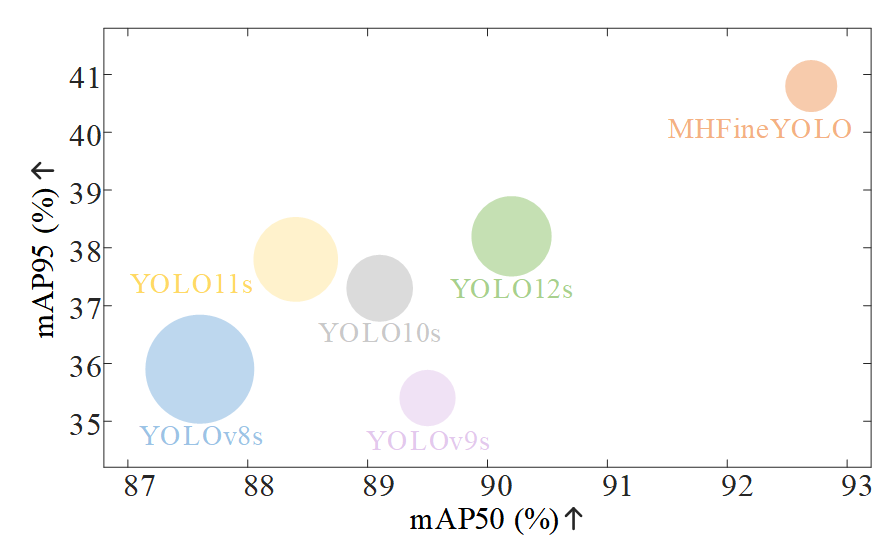
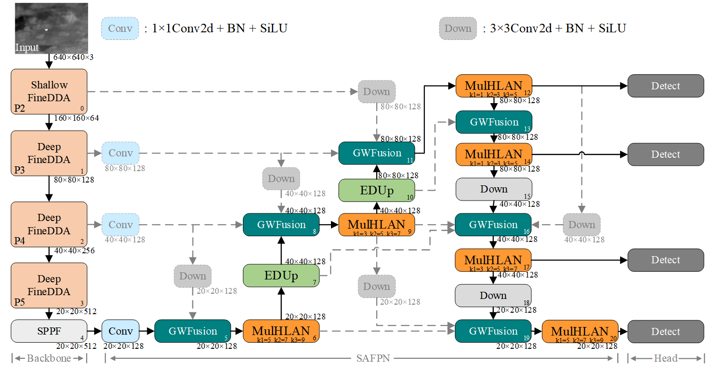
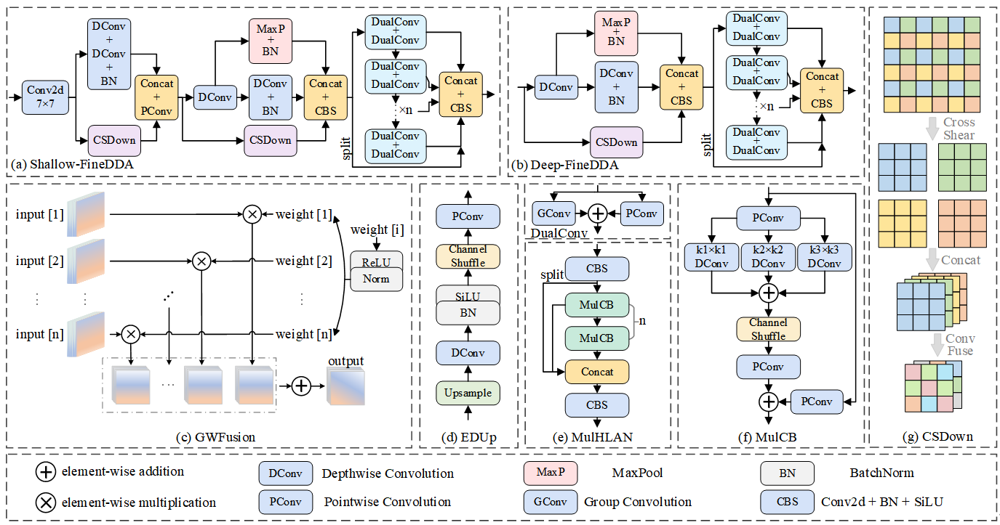
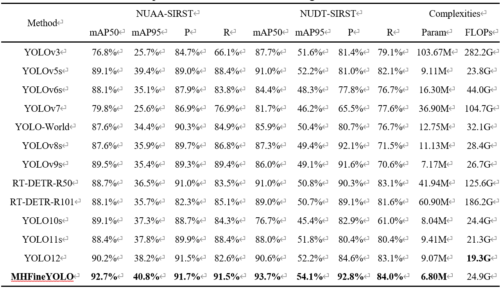
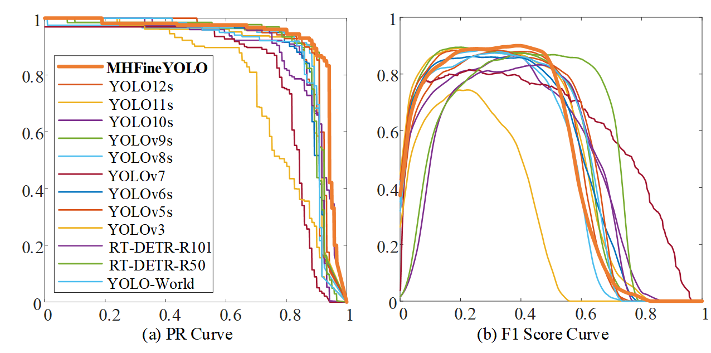

<h1>Multi-Scale Heterogeneous Convolution Enhanced Fine-Grained YOLO for Infrared Small Target Detection</h1>

<h2>Comparison of accuracy and complexity of different algorithms. The horizontal and vertical coordinates are the mAP50 and mAP95 of the model, respectively, and the area represents the number of parameters of the model.</h2>

<h2>MHFineYOLO network</h2>

<h2>Moudles in MHFineYOLO</h2>

<h2>Comparison with state-of-the-art target detection models.</h2>

<h2>Comparison of PR curves and F1 score curves for MHFineYOLO and other methods.</h2>

